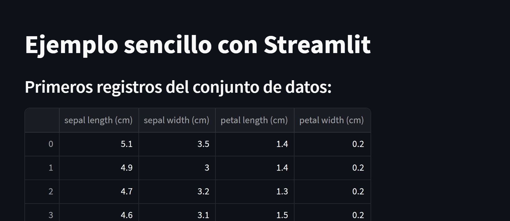

# Streamlit


## Introducción 

[Streamlit](https://streamlit.io/)  es una biblioteca de Python que ha revolucionado la forma en que los científicos de datos y desarrolladores pueden crear aplicaciones web interactivas con facilidad. A diferencia de las complejas herramientas de desarrollo web tradicionales, Streamlit se centra en la simplicidad y la eficiencia, permitiéndote convertir rápidamente tus análisis de datos, visualizaciones y modelos en aplicaciones web dinámicas y atractivas.

### ¿Por qué Streamlit es Especial?

1. **Sencillez y Velocidad:** Streamlit está diseñado para ser tan fácil como escribir un script de Python. No necesitas conocimientos profundos de HTML, CSS o JavaScript. En su lugar, puedes aprovechar tu conocimiento existente de Python para crear aplicaciones web.

2. **Interactividad en Tiempo Real:** Con unas pocas líneas de código, puedes agregar widgets interactivos como sliders, botones y checkboxes a tu aplicación. Estos elementos se actualizan en tiempo real según las interacciones del usuario, lo que brinda una experiencia interactiva y fluida.

3. **Integración con Bibliotecas de Visualización:** Streamlit se integra perfectamente con bibliotecas populares de visualización de datos como Matplotlib, Plotly y Altair. Puedes crear gráficos y visualizaciones interactivas directamente en tu aplicación.

4. **Widgets Predefinidos:** Streamlit ofrece una amplia variedad de widgets predefinidos que puedes usar para recopilar entradas del usuario y ajustar los parámetros de tus análisis y visualizaciones.

5. **Despliegue Fácil:** Una vez que hayas creado tu aplicación con Streamlit, desplegarla en la web es sencillo. Puedes usar plataformas en la nube como Heroku, AWS, o incluso Streamlit Sharing para compartir tu trabajo con otros.

6. **Caching Inteligente:** Streamlit tiene una función de caché integrada que te permite almacenar en caché resultados de cálculos costosos. Esto mejora el rendimiento de la aplicación al evitar que se recalculen los mismos resultados una y otra vez.

7. **Documentación Completa y Comunidad Activa:** Streamlit cuenta con una documentación detallada y una comunidad activa de usuarios que están dispuestos a ayudar y compartir ejemplos y consejos.


## Primeros Pasos

### Instalación

Para comenzar a utilizar Streamlit, primero necesitas instalarlo. Puedes instalarlo utilizando pip:

```bash
pip install streamlit
```

### Crear tu Primera Aplicación

Una vez instalado, puedes crear tu primera aplicación en unos pocos pasos sencillos.
Vamos a crear un script de python llamado `app.py` con las siguientes intrucciones:


```python
import streamlit as st
from sklearn import datasets
import pandas as pd
import matplotlib.pyplot as plt
import seaborn as sns
sns.set_style("whitegrid")

# Título de la aplicación
st.title('Ejemplo sencillo con Streamlit')

# Cargar un conjunto de datos de ejemplo (Iris)
iris = datasets.load_iris()
iris_data = pd.DataFrame(iris.data, columns=iris.feature_names)

# Mostrar los primeros registros del conjunto de datos
st.subheader('Primeros registros del conjunto de datos:')
st.dataframe(iris_data.head())

# Mostrar descripción estadística del conjunto de datos
st.subheader('Descripción estadística del conjunto de datos:')
st.write(iris_data.describe())

# Mostrar gráfico simple por columna
st.subheader('Gráficos por columna:')
for feature_name in iris.feature_names:
    st.subheader(f'Gráfico de {feature_name}')
    fig, ax = plt.subplots()
    ax.hist(iris_data[feature_name], bins=20)
    st.pyplot(fig)

# Pie de página
st.subheader('¡Fin del ejemplo!')
st.write('Gracias por usar Streamlit.')
```

Ejecuta tu script de Python en la línea de comandos:

```bash
streamlit run app.py
```

Una vez que ejecutes el comando, se abrirá una ventana en tu navegador 
con la aplicación que creaste.




